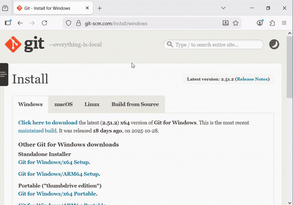

# SmartBot3

<br>

# Useful Commands and Keymaps
<details>
A comprehensive list of shell commands is beyond the scope of this repository. The available commands and keymaps may also vary depending on the system you are using. Fortunately there are many resources online for this, see [further reading](#further-reading) below.

* `pwd` print the **current working directory**
* `ls` list files in the **current working directory**
* `cd <path/to/file` Change Directory into the target path
* `cd ~` Move to your users HOME directory 
* `rm <file>` Delete a file
* `rm -rf` Delete a directory and its files
* `clear` clear the screen

Keymaps/Shortcuts. These are pressed *simultaneously*:
* `ctrl-c` Use to kill a process (SIGINT)
* `Ctrl-Shift-c` Copy
* `Ctrl-Shift-v` Paste
* `ctrl-d` 
* `ctrl-e` Move cursor to end of line
* `ctrl-a` Move cursor to beginning of line
</details>

<br>

# I am Confused and Angry About Typing Commands
<details>
`¯\_(ツ)_/¯`

## The Text Shell

A shell is any program you use to interface with a computer. A **text shell**
is, as the name implies, a text-only computer interface. Other common names are
"command prompt", "terminal", "tty". A common shell in linux is `Bash`, windows
has powershell and CMD. A **graphical shell** is how computers are most commonly
used today (buttons, windows, mouse cursor, etc).

Graphical shells are easy to learn and can be very effective. However, for the
shallow learning curve and high abstractness of a graphical shell we pay a
price. In a graphical shell if is no button or menu for what we want to do, _we
simply cannot do it_. A text shell will give you the freedom to do as you please
on your own terms provided you are willing to struggle.

Text shells are hard to learn in the same way language is hard to learn. There
is some upfront memorization necessary before you can do/say anything
non-trivial. Very quickly learning transitions away from memorization and
becomes exploration, play.

Eventually, rather than invoking the base set of commands as monosyllabic sentences
([holophrastics](https://en.wikipedia.org/wiki/Holophrasis)) you compose them.
This is not just a matter of efficiency but of being able to say entirely new
things. For example,

> "How many lines of text are there in all the python files in the current
> directory?"

becomes,

```sh
wc -l *.py
```

This is where the real power of a text interface arises. The translation of
human desire to a sequence of characters is less arcane when viewed through the
lens of sentence formation.

But just like "go", "to", and "hi" never stop being useful in human language the
base commands `cd`, `ls`, `du`, etc never stop being useful in the shell.
Fortunately the actions we need to learn how to do in the shell are relatively
few and we can quickly memorize the commands we will be repeating most often.

## The Prompt
Shells have many different forms of "prompts". A prompt is a metaphorical object where you provide your input and where additional details may be presented. Commonly the prompt will show your username along with the **current working directory** (i.e. where you are in the filesystem). This is important as the behaviour of many commands depends on *where they are run*. 

```bash
username@hostname:directory$
```

Often we give **file paths** to a command and this will be affected by where the command and file path are ran.


## Copying Command Examples
Angle brackets `<>` will be used to denote an argument that is mandatory. The string inside the brackets is semantically desriptive. Do not type the brackets when actually writing the command.

```bash
cd <path/to/dir>
```
will become something like,
```bash
cd src/
```
<br>

Square brackets `[ ]` are often used to indicate optional arguments and should be interpreted the same as angle brackets otherwise.

## Further Reading:
- https://linuxjourney.com/lesson/the-shell
- [In the Beginning... Was the Command Line](https://web.stanford.edu/class/cs81n/command.txt)
- [Bash Reference Manual](https://www.gnu.org/software/bash/manual/bash.html)
- https://en.wikipedia.org/wiki/Backus%E2%80%93Naur_form
- https://cheat.sh/
- https://devhints.io/bash
- https://en.wikipedia.org/wiki/Everything_is_a_file

</details>

<br>

# Installing System Dependencies

Your computer must have some minimal software packages installed before the
SmartBots can be used. Linux and windows are both supported. A mainstream Linux distro is
recommended since windows will require more troubleshooting and is generally difficult to work with.

## Linux Dependencies

<details linux_deps>
    <summary>Details</summary>
The following packages are needed:

- [Git](https://git-scm.com/install/windows)
- [Python3.12](https://www.python.org/downloads/release/python-31210/)
- [VSCode](https://code.visualstudio.com/download)

For **Debian based** distributions (Ubuntu/Mint/etc) these can be installed by
running the following command in a shell:

```bash
sudo apt update && sudo apt install git python
```

For **Arch based** distributions (Arch/PopOS/Manjaro/etc) these can be installed by
running the following command in a shell:

```bash
sudo pacman -Sy git python code
```

### Check that python was installed correctly

Check that python is installed, runnable, and the correct version by running the
following in a shell:

```bash
python --version
```

which should report `Python 3.12.10`.

</details>

## Windows Dependencies

<details win_deps>
    <summary>Details</summary>

The following packages are needed:

- [Git](https://git-scm.com/install/windows) (will install "Git" as well as "Git Bash".)
- [Python3.12 (Via Python Install Manager)](https://www.python.org/downloads/release/pymanager-250/)
- [VSCode](https://code.visualstudio.com/download)

### Git:

Download and install Git for windows.


See the following gif for details if you are confused.


<br>

### Python:

- Download **Python Install Manager**. This will install Python3.14 automatically.
- Choose 'y' when prompted to add commands directory to your PATH
- Chose 'y' when prompted to install the CPython runtime.
- Check that python3.12 was installed.


Then install **python3.12** using the Python Install Manager by running the following command in a command prompt shell (CMD).

```bash
py install 3.12
```


See the following gif for details if you are confused.


Check that python3.12 was installed correctly by running the following in a shell:

```bash
python3.12 --version
# Python 3.12.10
```

which should report `Python 3.12.10`.

<br>

### VSCode:

Install like you would any program. If you are confused see the following gif for details.


</details>

<br>

# Setting Up Your Workspace

- Clone the repo using git
- Open the `smartbot3_project_template` folder in VSCode
- Create a python [virtual environment](https://peps.python.org/pep-0405/) (venv)
- Install python dependencies and the python package  `smartbot_irl` (included inside the repo) into the virtual environment

Clone this repo with the following command (note the --recursive flag!):
```bash
git clone --recursive https://github.com/wvu-irl/smartbot3_project_template
```

See the following gif for details if you are confused.


This repo includes the `smartbot_irl` python package which we will use to control the IRL SmartBot. We will use a python **virtual environment** in our repos so that we can more easily install python packages. To create a virtual environment directory named `.venv` we will use VSCodes built in python tools.

Open VSCode and select **"Open Folder"** on the cloned repo. Install any recommended extensions. Then open the **command palette** with the keymap `<Ctrl-Shift-p>` and type `environment`. Select `Python: Create Environment` -> `Venv`. Wait for the packages in `requirements.txt to be installed to our venv.


Now we will install the `smartbot_irl` package to our venv as well so we can use it in our code. To do this open a terminal (check that the venv is active by looking for text like `(venv)` ) in vscode and run the following **inside the repo**.

```
pip install -e smartbot_irl
```

This will make an editable install of the `smartbot_irl` to your venv. To see if the venv is active look for text like `(venv)` in your terminal. If it is not active them your python code will not be able to find the packages we have installed


# Activating Robot

Before you can control the robot it must be powered on (using Estop and rocker switch) **and also activated by running the following script with the correct IP address**.

```bash
start_robot.bash 192.168.33.<num>
```

This will activate the hardware components in the robot (Lidar, drive motors, arm motors).

**This must be done only once until the robot is restarted or crashed**.

# Running Code

Before running code we must activate the robot (see previous section)!

There are a few demo programs included in `src/`. You should add your scripts here as well. Let's try and run the teleop example. If we open it in the editor we can click the small "Play" button at the top right. If our venv is created correctly and we have installed all the dependencies a PyGame window should appear. Arrow keys will move the robot. The PGUP/PGDOWN keys will open/close the gripper. The keys b/n/m will cycle the arm through the DOWN/STOW/HOLD positions.

You may also run the script from the gitbash shell with

```bash
.venv/Scripts/python.exe c:/Users/n/test_mobile_robotics_template/src/demo_teleop.py
```


To cycle through shell history the UP/DOWN arrow keys can be used.

## Running in sim/real

To change between a simulated and real robot modify the "mode" string to be "real"|"sim". To choose which real robot you are connecting to specify its IP address in the `SmartBot.init()` method.

```py
    # For SmartBot2.
    bot = SmartBot(mode="real", drawing=True, smartbot_num=2)
    bot.init(host="192.168.28.254", port=9090, yaml_path="default_conf.yml")

    # For a simulated SmartBot
    # bot = SmartBot(mode="sim", drawing=True, smartbot_num=3)
    # bot.init(drawing=True, smartbot_num=3)
```


# Guidance on Using `smartbot_irl`

The main classes in the `smartbot_irl` package are `SensorData`, `Command`, and
`SmartBot`. In the example scripts we create an instance `bot` from the
`SmartBot` class. This `SmartBot` instance `bot` has the _methods(A.K.A
functions)_ `SmartBot.read()`, `SmartBot.write()`, and `SmartBot.spin()`. For
the `bot` instance of `SmartBot` you will call these functions like so:

```py
bot=SmartBot()
# The following would go in the step() function.
my_sensor_data = bot.read()
# Your algorithm here
my_command = Command(
    linear_vel = 0.3, # Move forward at 0.3m/s
    angular_vel=0.4, # Rotate CCW
    gripper_closed=True, # Close the gripper.
)
bot.write(my_command)
```


# Box2D Local Sim

This uses the gymnasium+Box2D packages to visualize, and, optionally simulate a
2D world with the smartbot. The 2D simulator implements a simple kinematic model
of the robot and a simple grasping model for the hexes. The command and sensor
data types are identical between simulation and the real SmartBot.

# Troubleshooting

## The dir `smartbot_irl` is empty!

Try running the following inside of your project repo

```bash
git submodule update --init --recursive
```

## Updating smartbot_irl

The directory named smartbot*irl inside of your project directory is itself a
git repo and is called a \_git submodule*. To update/reset the contents of the
smartbot_irl package you can run the following command insode of your repo:

```
git -C smartbot_irl reset --hard main
git submodule update --checkout --recursive -f
```

## I Can't Get Lidar or Move the Robot!

Check the E-Stop button is off (meaning the lidar+motors have power)! When the
E-stop is activated power is cut to the robot motors and lidar but the computer
will still receive power (if the toggle switch is on).

## Updating The Template Repo

If you want to pull changes made to the template repo (not the smartbot_irl repo). Run the following in the project template directory.

```bash
git pull
```
