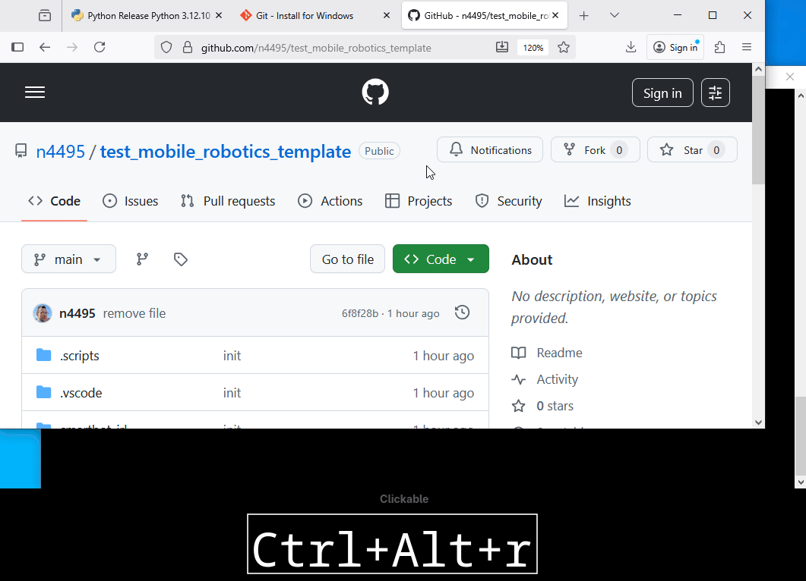
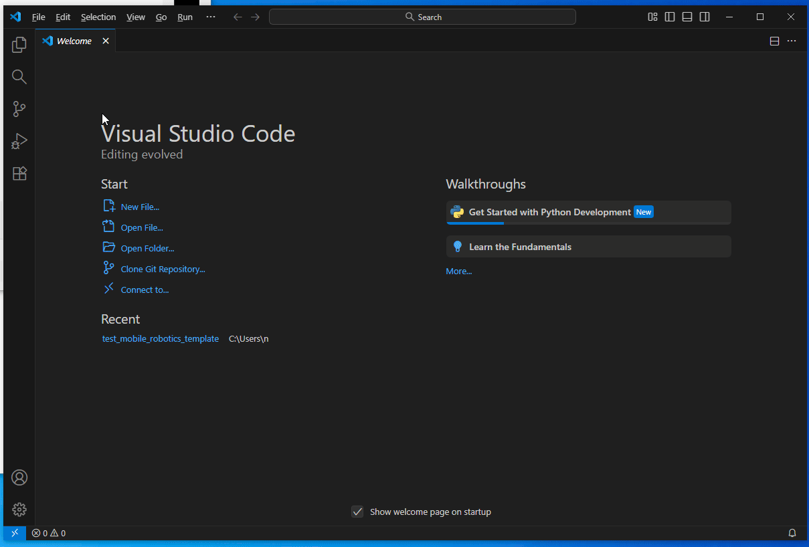
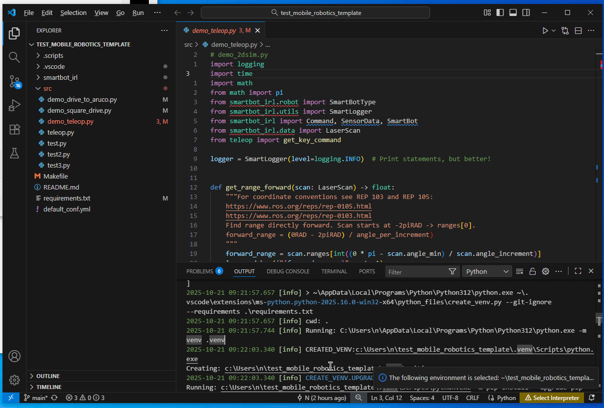
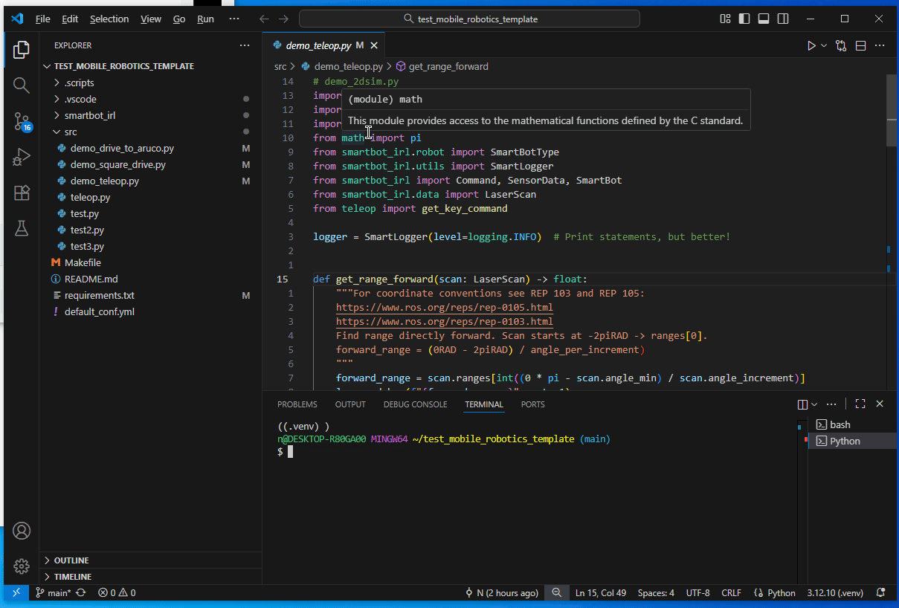
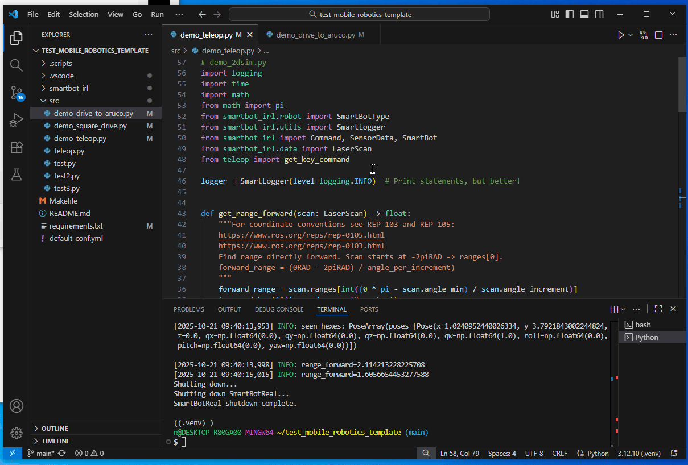
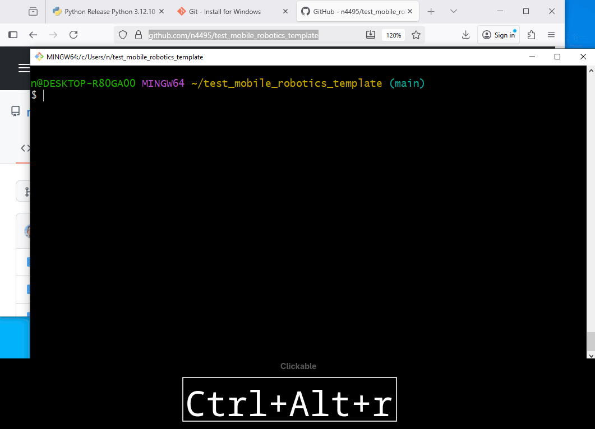

 # SmartBot3

https://github.com/wvu-irl/smartbot3_project_template/raw/refs/heads/dev/docs/videos/demo_2.mp4

https://raw.githubusercontent.com/wvu-irl/smartbot3_project_template/dev/docs/videos/demo_2.mp4

<video controls width="1000">
  <source src="
https://raw.githubusercontent.com/wvu-irl/smartbot3_project_template/dev/docs/videos/demo_2.mp4">
</video>

# Installing System Dependencies 
Your computer must have some minimal software packages installed before the
SmartBots can be used. Linux and windows are both supported. A mainstream Linux distro is
recommended since windows will require more troubleshooting and is generally difficult to work with.

## Linux Dependencies
<details linux_deps>
    <summary>Details</summary>
The following packages are needed:

* [Git](https://git-scm.com/install/windows)
* [Python3.12](https://www.python.org/downloads/release/python-31210/)
* [VSCode](https://code.visualstudio.com/download)

For **Debian based** distributions (Ubuntu/Mint/etc) these can be installed by
running the following command in a shell:
```bash
sudo apt update && sudo apt install git python
```
 
For **Arch based** distributions (Arch/PopOS/Manjaro/etc) these can be installed by
running the following command in a shell:
    
```bash
sudo pacman -Sy git python code
```

    
### Check that python was installed correctly
Check that python is installed, runnable, and the correct version by running the
following in a shell:
 
```bash
$ python --version
```

which should report `Python 3.12.10`.

</details>

## Windows Dependencies

<details open win_deps>
    <summary>Details</summary>
The following packages are needed:

* [Git](https://git-scm.com/install/windows) (will install "Git" as well as "Git Bash".)
* [Python3.12 (Via Python Install Manager)](https://www.python.org/downloads/release/pymanager-250/)
* [VSCode](https://code.visualstudio.com/download)

### Git:
Download and install Git for windows.


### Python:
Download and install the *Python Install Manager*. 

<video controls width="1000" poster="./docs/gifs/demo_path.gif">
  <source src="./docs/videos/demo.webm" type="video/webm">
</video>

 <video controls width="500">
  <source src="./docs/videos/demo.webm" type="video/webm">
  <source src="https://raw.githubusercontent.com/USER/REPO/BRANCH/docs/assets/foo.mp4" type="video/mp4">
  
</video>
    

    
Run the Python Install Manager and follow the prompts as shown in the image
below.


Now install **python3.12** using the Python Install Manager by running the
following command in a command prompt shell (CMD).
```
    asd
    
```
### Check that python was installed correctly
After installing python3.12 check python is installed, runnable, and the correct
version by running the following in a shell:

```bash
$ python --version
```

which should report `Python 3.12.10`.

</details>

# Setting Up Your Workspace
* Clone repo
* `cd` into cloned repo directory
* Open repo folder in VSCode 
* Create a python virtual environment (venv)
* Pip install `smartbot_irl` and python deps into the virtual environment

Open the program [**Git Bash**](https://www.atlassian.com/git/tutorials/git-bash) which was installed with Git. This is minimal bash-like text shell where we will type commands. Run the following to download the template repo:

```bash
git clone --recursive https://github.com/wvu-irl/smartbot3_project_template
cd smartbot3_project_template
ls -a
```



This repo includes the `smartbot_irl` python package which we will use to control the IRL SmartBot. We will use a python **virtual environment** in our repos so that we can more easily install python packages. To create a virtual environment directory named `.venv` we will use VSCodes built in python tools.

Open VSCode and select **"Open Folder"** on the cloned repo. Install any recommended extensions. Then open the **command palette** with the keymap `<Ctrl-Shift-p>` and type `environment`. Select `Python: Create Environment` -> `Venv`. Wait for the packages in `requirements.txt to be installed to our venv.



Now we will install the `smartbot_irl` package to our venv as well so we can use it in our code. To do this open a terminal (check that the venv is active by looking for text like `(venv)` ) in vscode and run the following **inside the repo**.
```
pip install -e smartbot_irl
```
This will make an editable install of the `smartbot_irl` to your venv. To see if the venv is active look for text like `(venv)` in your terminal. If it is not active them your python code will not be able to find the packages we have installed


# Activating Robot
Before you can control the robot it must be powered on (using Estop and rocker switch) **and also activated by running the following script with the correct IP address**.
```bash
start_robot.bash 192.168.33.<num>
```
This will activate the hardware components in the robot (Lidar, drive motors, arm motors). 

**This must be done only once until the robot is restarted or crashed**.


# Running Code
Before running code we must activate the robot (see previous section)!

There are a few demo programs included in `src/`. You should add your scripts here as well. Let's try and run the teleop example. If we open it in the editor we can click the small "Play" button at the top right. If our venv is created correctly and we have installed all the dependencies a PyGame window should appear. Arrow keys will move the robot. The PGUP/PGDOWN keys will open/close the gripper. The keys b/n/m will cycle the arm through the DOWN/STOW/HOLD positions.

You may also run the script from the gitbash shell with
```bash
.venv/Scripts/python.exe c:/Users/n/test_mobile_robotics_template/src/demo_teleop.py
```



To cycle through shell history the UP/DOWN arrow keys can be used.

## Running in sim/real
To change between a simulated and real robot modify the "mode" string to be "real"|"sim". To choose which real robot you are connecting to specify its IP address in the `SmartBot.init()` method.
```py
    # For SmartBot2.
    bot = SmartBot(mode="real", drawing=True, smartbot_num=2)
    bot.init(host="192.168.28.254", port=9090, yaml_path="default_conf.yml")
    
    # For a simulated SmartBot
    # bot = SmartBot(mode="sim", drawing=True, smartbot_num=3)
    # bot.init(drawing=True, smartbot_num=3)
```



# Guidance on Using `smartbot_irl`
The main classes in the `smartbot_irl` package are `SensorData`, `Command`, and
`SmartBot`. In the example scripts we create an instance `bot` from the
`SmartBot` class. This `SmartBot` instance `bot` has the *methods(A.K.A
functions)* `SmartBot.read()`, `SmartBot.write()`, and `SmartBot.spin()`. For
the `bot` instance of `SmartBot` you will call these functions like so:
```py
bot=SmartBot()
# The following would go in the step() function.
my_sensor_data = bot.read()
# Your algorithm here
my_command = Command(
    linear_vel = 0.3, # Move forward at 0.3m/s
    angular_vel=0.4, # Rotate CCW
    gripper_closed=True, # Close the gripper.
) 
bot.write(my_command)
```
-
# Box2D Local Sim
This uses the gymnasium+Box2D packages to visualize, and, optionally simulate a
2D world with the smartbot. The 2D simulator implements a simple kinematic model
of the robot and a simple grasping model for the hexes. The command and sensor
data types are identical between simulation and the real SmartBot.


# Troubleshooting
## The dir `smartbot_irl` is empty!
Try running the following inside of your project repo
```bash
git submodule update --init --recursive
```


## Updating smartbot_irl
The directory named smartbot_irl inside of your project directory is itself a
git repo and is called a *git submodule*. To update/reset the contents of the
smartbot_irl package you can run the following command insode of your repo:
```
git -C smartbot_irl reset --hard main
git submodule update --checkout --recursive -f
```

## I Can't Get Lidar or Move the Robot!
Check the E-Stop button is off (meaning the lidar+motors have power)! When the
E-stop is activated power is cut to the robot motors and lidar but the computer
will still receive power (if the toggle switch is on).


## Updating The Template Repo
If you want to pull changes made to the template repo (not the smartbot_irl repo). Run the following in the project template directory.
```bash
git pull
```
=======
#git submodule update --init --recursive SmartBot3 Mobile Robotics

# System Dependencies

On your computer you must have the following installed.

* [Git](https://git-scm.com/install/windows)
* [Python3.12](https://www.python.org/downloads/release/python-31210/)
* [VSCode](https://code.visualstudio.com/download)

"Git for Windows" will install the version control software "Git" as well as "Git Bash".

After installing python3.12 check your python version by running the following in a gitbash shell:
```bash
$ python --version
```

which should report `Python 3.12.10`.

# Setting Up Your Workspace
* Clone repo
* `cd` into cloned repo directory
* Open repo folder in VSCode 
* Create a python virtual environment (venv)
* Pip install `smartbot_irl` and python deps into the virtual environment

Open the program [**Git Bash**](https://www.atlassian.com/git/tutorials/git-bash) which was installed with Git. This is minimal bash-like text shell where we will type commands. Run the following to download the template repo:

```bash
git clone --recursive https://github.com/wvu-irl/smartbot3_project_template
cd smartbot3_project_template
ls -a
```


This repo includes the `smartbot_irl` python package which we will use to control the IRL SmartBot. We will use a python **virtual environment** in our repos so that we can more easily install python packages. To create a virtual environment directory named `.venv` we will use VSCodes built in python tools.

Open VSCode and select **"Open Folder"** on the cloned repo. Install any recommended extensions. Then open the **command palette** with the keymap `<Ctrl-Shift-p>` and type `environment`. Select `Python: Create Environment` -> `Venv`. Wait for the packages in `requirements.txt to be installed to our venv.


Now we will install the `smartbot_irl` package to our venv as well so we can use it in our code. To do this open a terminal (check that the venv is active by looking for text like `(venv)` ) in vscode and run the following **inside the repo**.
```
pip install -e smartbot_irl
```
This will make an editable install of the `smartbot_irl` to your venv. To see if the venv is active look for text like `(venv)` in your terminal. If it is not active them your python code will not be able to find the packages we have installed


<!-- ```bash
python3 -m venv .venv # Run this inside the repo
```
which should result in a new directory named `<your_repo>/.venv` which is a **hidden directory** that can be seen with the command `ls -a`. 

Now to install `smartbot_irl` and dependencies **from inside the repo** run:
```bash
.venv/Scripts/pip install -e smartbot_irl
```

[More information on VSCode and venv's](https://code.visualstudio.com/docs/python/python-tutorial#_start-vs-code-in-a-workspace-folder)

 -->

# Running Code
There are a few demo programs included in `src/`. You should add your scripts here as well. Let's try and run the teleop example. If we open it in the editor we can click the small "Play" button at the top right. If our venv is created correctly and we have installed all the dependencies a PyGame window should appear. Arrow keys will move the robot. The PGUP/PGDOWN keys will open/close the gripper. The keys b/n/m will cycle the arm through the DOWN/STOW/HOLD positions.

You may also run the script from the gitbash shell with
```bash
.venv/Scripts/python.exe c:/Users/n/test_mobile_robotics_template/src/demo_teleop.py
```


To cycle through shell history the UP/DOWN arrow keys can be used.

## Running in sim/real
To change between a simulated and real robot modify the "mode" string to be "real"|"sim". To choose which real robot you are connecting to specify its IP address in the `SmartBot.init()` method.
```py
    # For SmartBot2.
    bot = SmartBot(mode="real", drawing=True, smartbot_num=2)
    bot.init(host="192.168.28.254", port=9090, yaml_path="default_conf.yml")
    
    # For a simulated SmartBot
    # bot = SmartBot(mode="sim", drawing=True, smartbot_num=3)
    # bot.init(drawing=True, smartbot_num=3)
```


# Troubleshooting
## The dir `smartbot_irl` is empty!
Try running the following inside of your project repo
```bash
git submodule update --init --recursive
```
>>>>>>> Stashed changes
